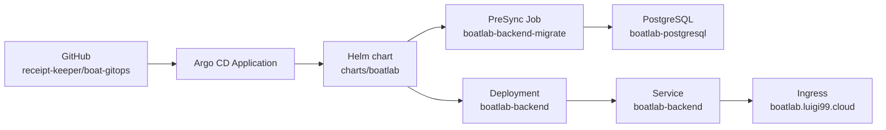

# Architecture

이 저장소는 Boatlab backend를 Argo CD로 배포하기 위한 GitOps 저장소다.
배포 단위는 하나의 Helm chart이며, 환경 차이는 `values-dev.yaml`과
`values-prod.yaml`로만 표현한다.

## Goals

- dev/prod 환경을 같은 template로 배포한다.
- Argo CD가 Git을 단일 배포 기준으로 삼게 한다.
- Alembic migration은 애플리케이션 시작과 분리해서 Argo CD hook으로 실행한다.
- Secret 원문은 Git에 저장하지 않는다.

## Repository Layout

```text
.
|-- .github/
|   |-- workflows/validate.yaml
|   `-- PULL_REQUEST_TEMPLATE.md
|-- argocd/
|   `-- applications/
|       |-- boatlab-dev.yaml
|       `-- boatlab-prod.yaml
|-- charts/
|   `-- boatlab/
|       |-- Chart.yaml
|       |-- values.yaml
|       |-- values-dev.yaml
|       |-- values-prod.yaml
|       `-- templates/
|-- AGENTS.md
|-- ARCHITECTURE.md
|-- CONTRIBUTING.md
`-- README.md
```

## Deployment Model



Argo CD는 환경별 Application을 통해 같은 chart를 서로 다른 values 파일로
렌더링한다.

| Environment | Application | Namespace | Values file | Host |
|-------------|-------------|-----------|-------------|------|
| dev | `boatlab-dev` | `boatlab-dev` | `values-dev.yaml` | `boatlab-dev.luigi99.cloud` |
| prod | `boatlab-prod` | `boatlab-prod` | `values-prod.yaml` | `boatlab.luigi99.cloud` |

## Resource Ownership

| Resource | Kind | Owner |
|----------|------|-------|
| `boatlab-backend` | Deployment, Service, Ingress | Helm chart |
| `boatlab-backend-migrate` | Job | Argo CD PreSync hook |
| `boatlab-postgresql` | StatefulSet, Service | Helm chart |
| `data-boatlab-postgresql-0` | PVC | StatefulSet volume claim template |
| `boatlab-*-tls` | TLS Secret | cert-manager |
| `boatlab-backend-app` | Secret | external input |
| `boatlab-backend-db` | Secret | external input |
| `boatlab-firebase` | Secret | external input |
| `ghcr-secret` | Secret | external input |

## Migration Strategy

Alembic은 `boatlab-backend-migrate` Job에서 실행한다. PostgreSQL Service와
StatefulSet은 Argo CD `PreSync` wave `-2`, migration Job은 `PreSync` wave `-1`로
렌더링한다. 새 namespace의 첫 sync에서도 DB가 먼저 생성된 뒤 migration이 실행된다.
migration Job은 애플리케이션 Deployment와 같은 backend image tag를 사용한다.

이 방식은 다음 의도를 가진다.

- 앱 컨테이너 시작 책임과 DB migration 책임을 분리한다.
- sync 때 migration 실패를 먼저 노출한다.
- schema가 올라간 뒤 새 Deployment가 rollout되도록 한다.

Migration Job은 `BeforeHookCreation,HookSucceeded` 정책으로 이전 성공 hook을
정리한다. 실패한 hook은 원인 확인을 위해 남을 수 있다.

## Secret Contract

Secret은 chart가 생성하지 않는다. 각 namespace에 아래 Secret을 먼저 만들어야
한다.

- `boatlab-backend-app`
  - `DATABASE_URL`
  - `APP_ENV`
  - `JWT_SECRET_KEY`
  - `JWT_ALGORITHM`
  - `JWT_ISSUER`
  - `JWT_AUDIENCE`
  - `ACCESS_TOKEN_EXPIRES_MINUTES`
  - `REFRESH_TOKEN_EXPIRES_DAYS`
  - `REFRESH_TOKEN_PEPPER`
  - Firebase/OCR provider settings
- `boatlab-backend-db`
  - `POSTGRES_USER`
  - `POSTGRES_PASSWORD`
  - `POSTGRES_DB`
- `boatlab-firebase`
  - Firebase service account file
- `ghcr-secret`
  - GHCR pull credential

## Sync Policy

dev는 자동 sync, prune, self-heal을 켠다. prod는 기본적으로 수동 sync다. prod 자동
sync는 운영 절차와 rollback 기준이 확정된 뒤 별도 PR로 변경한다.

## Rollback

이미지 rollback은 values 파일의 `image.tag`를 이전 tag로 되돌리는 PR로 수행한다.
DB migration은 기본적으로 forward-only로 본다. destructive migration은 backend
PR 단계에서 별도 rollback plan을 문서화해야 한다.

## Validation

기본 검증은 cluster access 없이 수행한다.

```bash
helm lint charts/boatlab -f charts/boatlab/values-dev.yaml
helm lint charts/boatlab -f charts/boatlab/values-prod.yaml
helm template boatlab charts/boatlab -f charts/boatlab/values-dev.yaml
helm template boatlab charts/boatlab -f charts/boatlab/values-prod.yaml
```

실제 cluster 적용 전에는 Argo CD diff 또는 staging namespace sync로 확인한다.
