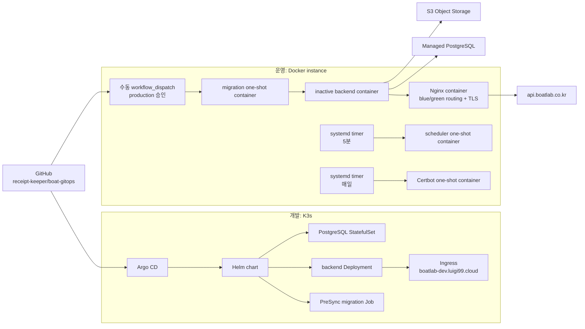

# Architecture

## 배포 모델

Boatlab은 개발과 운영의 배포 주체를 분리한다. 개발은 homelab K3s의 Argo CD가
관리하고, 운영은 별도 인스턴스에서 Docker Compose로 실행한다.

운영의 Nginx, backend blue/green, migration, scheduler, Certbot은 모두 컨테이너다.
systemd는 scheduler와 인증서 갱신 컨테이너의 실행 시각만 관리한다.

## 소유권

| 대상 | 소유자 | 기준 파일 |
|---|---|---|
| dev Application | Argo CD | `argocd/applications/boatlab-dev.yaml` |
| dev backend, PostgreSQL, migration | Helm | `charts/boatlab/` |
| prod Nginx, backend, one-shot 작업 | Docker Compose | `deploy/prod/compose.yaml` |
| prod 릴리스 정보 | Git | `deploy/prod/config/release.env` |
| prod 배포 순서와 슬롯 전환 | 배포 스크립트 | `deploy/prod/scripts/deploy.sh` |
| prod scheduler와 인증서 갱신 | systemd | `deploy/prod/systemd/` |
| prod runtime Secret | GitHub Environment | `PRODUCTION_RUNTIME_ENV` |
| Firebase 서비스 계정 | GitHub Environment | `PRODUCTION_FIREBASE_JSON` |

운영 Kubernetes namespace나 Application은 존재하지 않으며 새로 생성하지 않는다.

## 운영 배포 순서

수동 workflow는 다음 순서를 고정한다.

1. 입력 버전과 Git tag·revision, GHCR version·SHA tag, digest가 `release.env`와 일치하는지 확인하고 Secret 계약을 검증한다.
2. 운영 파일과 Secret을 제한된 권한으로 서버에 설치한다.
3. 임시 GHCR Docker config로 이미지를 pull한다.
4. 같은 이미지로 `alembic upgrade head`를 실행한다.
5. 현재 active 반대 슬롯을 시작하고 container health를 확인한다.
6. 최초 배포라면 HTTP-01 challenge로 인증서를 발급한다.
7. Nginx config 검사 후 upstream을 새 슬롯으로 전환한다.
8. `https://api.boatlab.co.kr/health`를 로컬 origin에서 인증서 검증과 함께 확인한다.
9. active 슬롯과 릴리스 정보를 원자적으로 기록한 뒤 이전 슬롯을 종료한다.
10. 임시 GHCR credential을 삭제하고 systemd timer를 활성화한다.

health 또는 Nginx 전환이 실패하면 새 슬롯을 종료하고 기존 active 슬롯을 유지한다.
DB migration은 forward-only로 취급하므로 migration은 이전 앱 버전과 호환되어야 한다.

## Secret 경계

Git에는 Secret 값을 저장하지 않는다. workflow는 runtime dotenv를 실행하지 않고
구조만 파싱한다. Firebase JSON은 `type`, `project_id`, `private_key`, `client_email`을
확인하고 runtime의 `FIREBASE_PROJECT_ID`와 일치하는지만 검사한다.

Firebase JSON은 backend blue/green 컨테이너에만 read-only secret으로 mount한다.
migration과 scheduler에는 필요하지 않다. scheduler는 outbox까지만 만들고 API
프로세스의 outbox relay가 Firebase Admin SDK로 실제 FCM을 발송한다.

instance와 object storage bucket의 resource access를 연결하므로 정적
`S3_ACCESS_KEY_ID`, `S3_SECRET_ACCESS_KEY`는 운영 runtime env에 넣지 않는다.

## Rollback

`release.env`를 이전 정상 릴리스로 되돌리는 PR을 병합한 뒤 해당 버전을 같은 수동
workflow에 입력한다. inactive 슬롯 health가 성공한 경우에만 Nginx가 전환된다.
새 배포가 전환 전에 실패하면 기존 슬롯은 계속 요청을 처리한다. schema downgrade는
자동 실행하지 않는다.

## 검증 경계

- PR: dev Helm lint/render, Compose config, Bash syntax, Nginx bootstrap/final config,
  workflow 계약과 dev 파일 불변을 검사한다.
- 배포: 인증서 발급/갱신, migration head, HTTPS health, scheduler timer를 검사한다.
- E2E: 로그인, refresh, OCR multipart, S3 업로드·조회·삭제, notification·outbox·FCM,
  blue/green 교대와 실패 시 기존 슬롯 유지를 검사한다.
